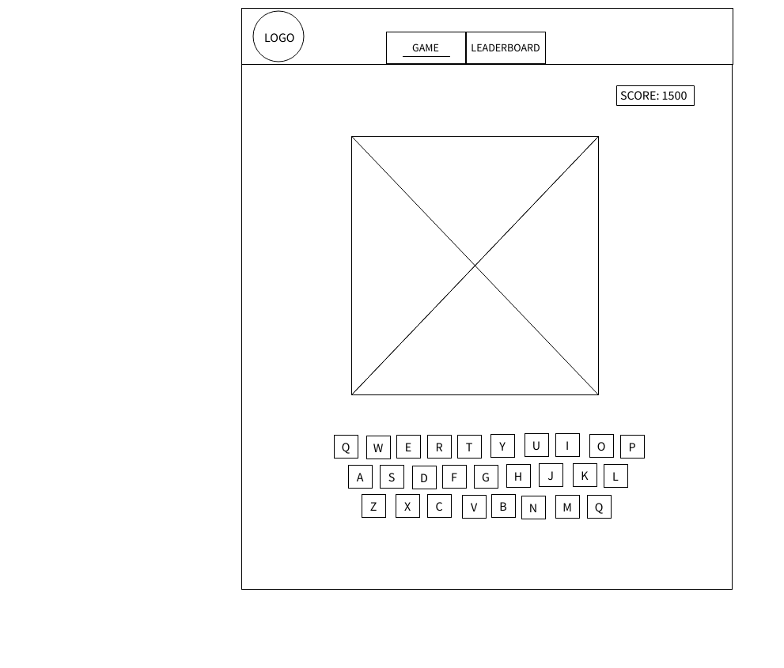
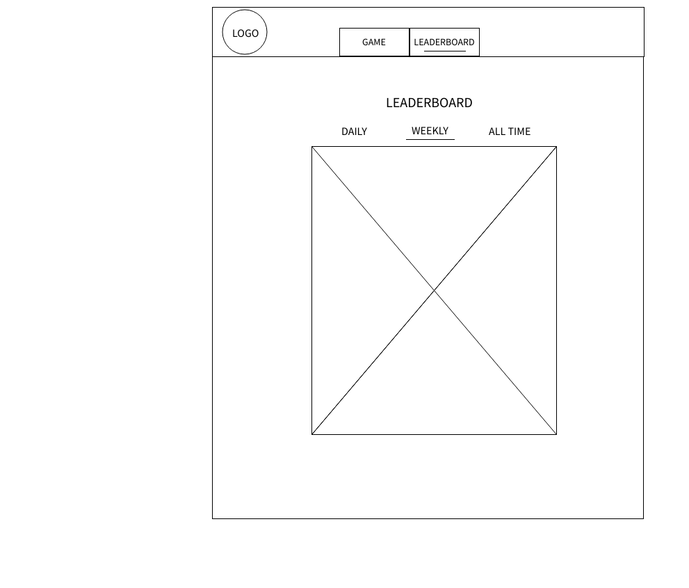

# Hangman With A Twist

Publicly accessible at: https://hangman-e3d03.web.app

## Sprint Progress

Update your progress by checking off the tasks for each sprint. We will **not** be using issues for solo projects.

### Sprint 1

- [x] Get app approved (DM Scott for approval)
- [x] Create mockups (physical paper, low-fi)
- [x] Define scope (DM Scott for approval)
  - [x] Define milestones for each sprint
  - [x] Define final deliverable for v1
- [x] App must
  - [x] Be publicly accessible
  - [x] Have working authentication
  - [x] Have technical component 5% done

### Sprint 2

- [x] Technical component 25%
- [x] Re-evaluate milestones and features
- [x] UI 100% finished
- [x] Logic 50% finished

### Sprint 3

- [x] Technical component 50%
- [x] Re-evaluate milestones and features
- [x] Finish all logic
- [x] Add algorithm

### Sprint 4

- [x] Technical component 100%

## Mockups

